# pipedoc Architecture

**pipedoc** is a CLI-based DevOps agent for the CI lifecycle. This document outlines the complete system architecture, data flow, component interactions, and design principles.

---

## System Overview

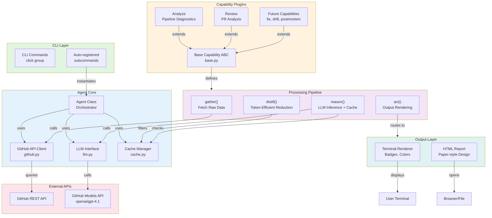

---

## Component Architecture

### 1. **Core Layer** (`pipedoc/core/`)

```mermaid
graph LR
    subgraph GitHub["GitHub Module<br/>github.py"]
        parse["parse_url<br/>Extract owner/repo/id"]
        failed["failed_jobs<br/>List failures"]
        log["job_log<br/>Fetch logs"]
        diff["pr_diff<br/>Fetch diffs"]
        meta["pr_meta<br/>Metadata"]
    end
    
    subgraph LLM["LLM Module<br/>llm.py"]
        call["call<br/>Make inference"]
        parse_json["parse_json<br/>Extract JSON"]
        track["track_cost<br/>Telemetry"]
    end
    
    subgraph Filters["Filters Module<br/>filters.py"]
        error_win["error_window<br/>Extract context"]
        diff_file["diff_per_file<br/>Chunk diffs"]
        skip["SKIP_FILES<br/>Regex"]
        cap["MAX_CHARS=12000<br/>Hard limit"]
    end
    
    subgraph Cache["Cache Module<br/>cache.py"]
        finger["fingerprint<br/>SHA-256 hash"]
        norm["normalize<br/>Reduce variance"]
        store["store/load<br/>~/.pipedoc_cache.json"]
    end
    
    GitHub -->|"raw logs<br/>diffs"| Filters
    Filters -->|"windowed<br/>text"| Cache
    Cache -->|"fingerprint"| LLM
    LLM -->|"cached?"| Cache
    LLM -->|"call"| models["GitHub Models API"]
    
    style GitHub fill:#bbdefb
    style LLM fill:#bbdefb
    style Filters fill:#c8e6c9
    style Cache fill:#ffe0b2
```

### 2. **Capability System** (`pipedoc/capabilities/`)

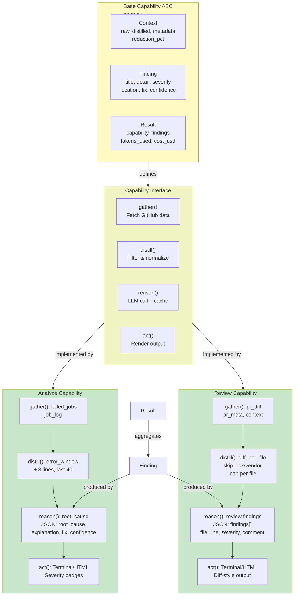

---

## Data Flow Diagrams

### Pipeline Failure Analysis Flow

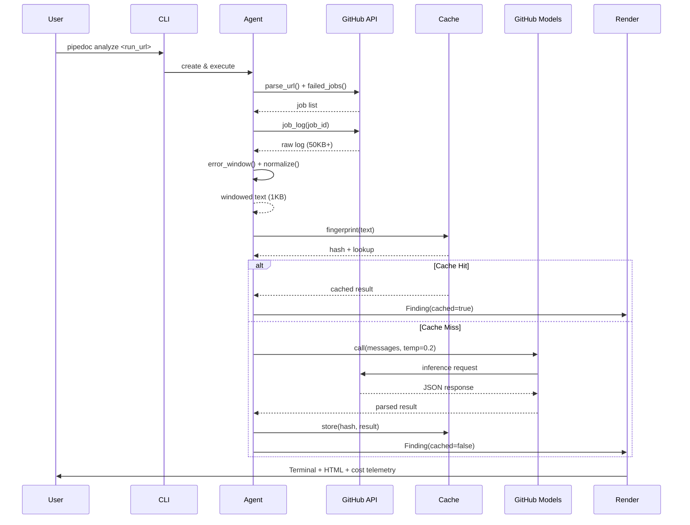

### PR Review Flow

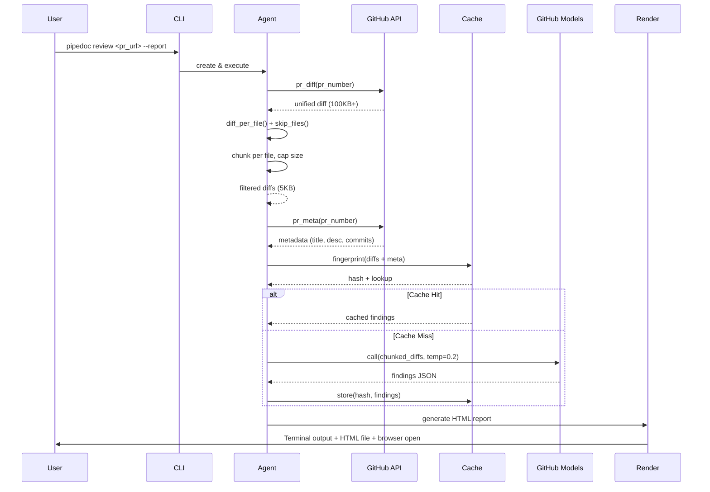

---

## 4-Step Capability Lifecycle

Every capability implements this contract:

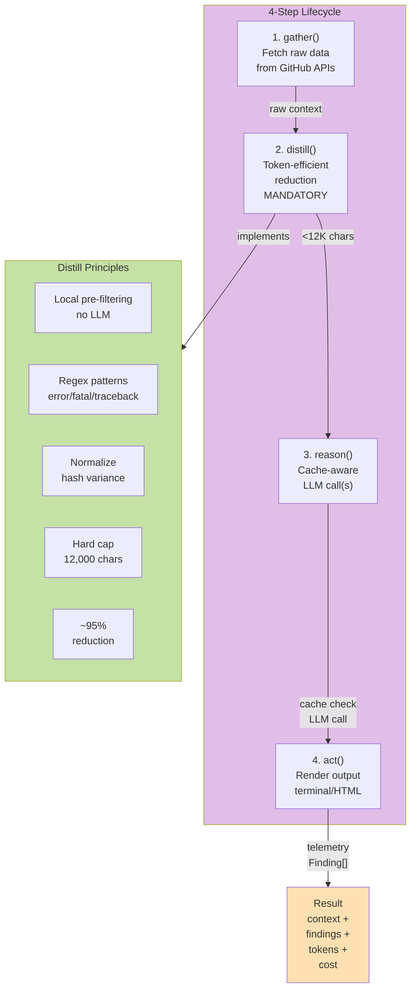

---

## Token-Efficiency Strategy

```mermaid
graph LR
    subgraph Input["Input<br/>Raw Log 50KB"]
        raw["Raw text"]
    end
    
    subgraph LocalFilter["Local Pre-Filter<br/>No LLM Cost"]
        regex["Regex extraction<br/>error/fatal/traceback<br/>±8 lines context"]
        last["Keep last 40 lines<br/>Often root cause"]
        cap["Cap 12,000 chars<br/>Hard limit"]
    end
    
    subgraph Normalization["Normalization<br/>Reduce Variance"]
        hashes["<hash> for URLs"]
        lines["line <n> for line nums"]
        paths["<tmp> for temp paths"]
    end
    
    subgraph Fingerprint["Fingerprint Cache<br/>SHA-256"]
        cache["Lookup fingerprint"]
        hit["CACHE HIT<br/>$0.00<br/>Zero LLM calls"]
        miss["CACHE MISS<br/>LLM call<br/>~2,100 tokens"]
    end
    
    subgraph Telemetry["Cost Telemetry"]
        before["Chars before:<br/>50,000"]
        after["Chars after:<br/>1,200"]
        pct["Reduction:<br/>97.6%"]
        cost["Cost: $0.02<br/>vs $0.96 naive"]
    end
    
    Input -->|"apply"| LocalFilter
    LocalFilter -->|"normalize"| Normalization
    Normalization -->|"hash"| Fingerprint
    Fingerprint -->|"hit or miss"| miss
    Fingerprint -->|"hit"| hit
    miss -->|"track"| Telemetry
    
    style Input fill:#ffcdd2
    style LocalFilter fill:#c8e6c9
    style Normalization fill:#c8e6c9
    style Fingerprint fill:#ffe0b2
    style Telemetry fill:#b3e5fc
    style hit fill:#a5d6a7
```

---

## CLI Structure & Auto-Registration

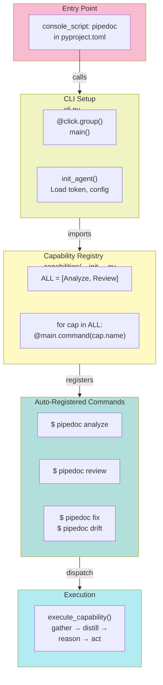

---

## Data Models

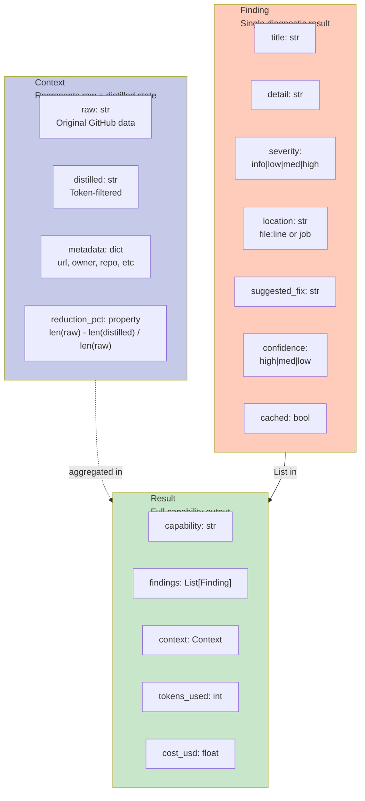

---

## Output Rendering Pipeline

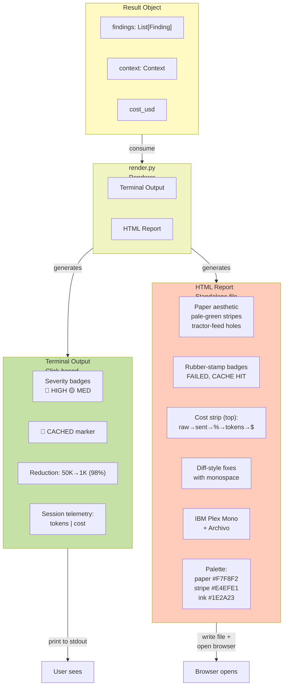

---

## Configuration & Initialization

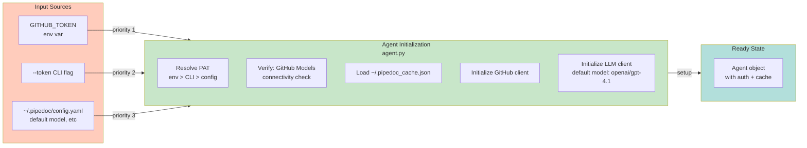

---

## Error Handling & Resilience

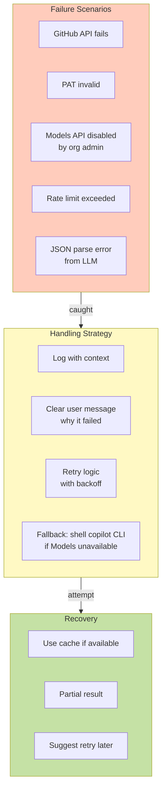

---

## Extension Points (Future Capabilities)

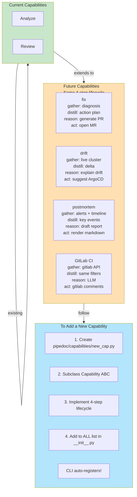

---

## Deployment & Distribution

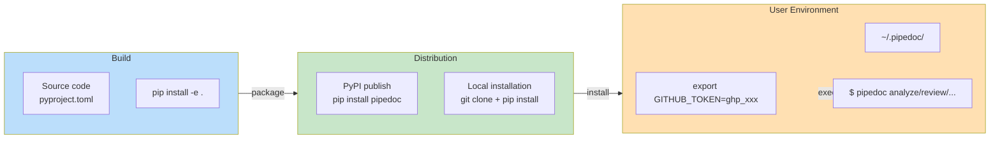

---

## Security & Permissions

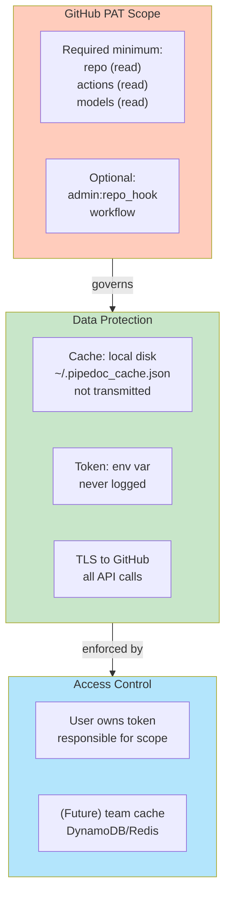

---

## Performance Characteristics

| Scenario | Time | Tokens | Cost | Notes |
|----------|------|--------|------|-------|
| Analyze (cache miss) | ~2s | 2,100 | $0.02 | Includes GitHub API calls |
| Analyze (cache hit) | ~100ms | 0 | $0.00 | Fingerprint lookup only |
| Review small PR (miss) | ~3s | 3,500 | $0.03 | <5 files, <10KB diff |
| Review large PR (miss) | ~5s | 6,800 | $0.06 | >20 files, >50KB diff |
| Review (cache hit) | ~100ms | 0 | $0.00 | Fingerprint lookup |

---

## Deployment Checklist

- [ ] `pyproject.toml` defines package + console script
- [ ] `pipedoc/core/github.py` — GitHub client (parse, jobs, logs, diffs)
- [ ] `pipedoc/core/llm.py` — GitHub Models client + cost tracking
- [ ] `pipedoc/core/filters.py` — error_window, diff_per_file, SKIP_FILES
- [ ] `pipedoc/core/cache.py` — fingerprint, Cache class
- [ ] `pipedoc/capabilities/base.py` — Capability ABC, Context/Finding/Result
- [ ] `pipedoc/capabilities/analyze.py` — 4-step pipeline diagnosis
- [ ] `pipedoc/capabilities/review.py` — 4-step PR review
- [ ] `pipedoc/capabilities/__init__.py` — ALL registry + CLI registration
- [ ] `pipedoc/cli.py` — click group, auto-registration
- [ ] `pipedoc/agent.py` — Agent orchestrator
- [ ] `pipedoc/render.py` — Terminal + HTML rendering
- [ ] Test with real GitHub token (Actions run + PR)
- [ ] Generate HTML report from mock; verify design
- [ ] Cost telemetry live on screen

---

## References

- **GitHub Models API:** https://models.github.ai/inference/chat/completions
- **GitHub REST API Docs:** https://docs.github.com/en/rest
- **Click Documentation:** https://click.palletsprojects.com/
- **Mermaid Diagram Syntax:** https://mermaid.js.org/
